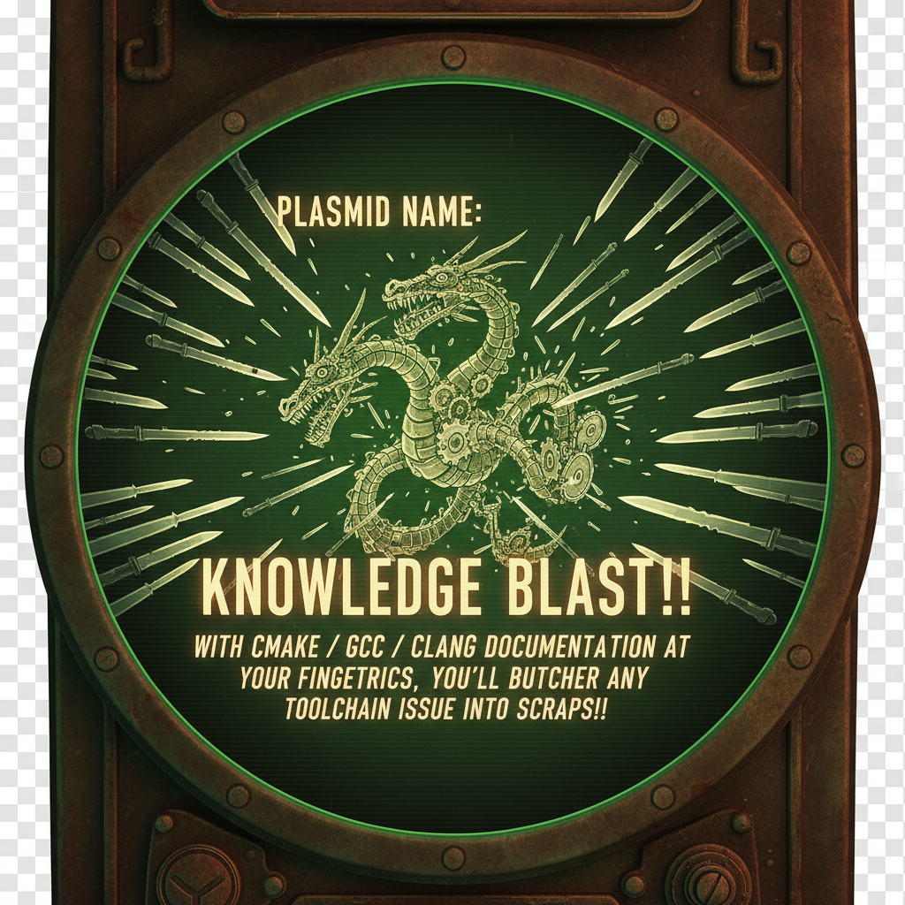

 
# Knowledge Blast!! Augment Yourself with Super-AI Powers

### Download `clang` Documentation
* Access the Clang docs, and RMB save link as ... and save each reference section you want to a helpfully named folder
  `https://releases.llvm.org/18.1.4/tools/clang/docs/index.html\#`
### `gcc` Documentation
* Access the gcc user manual html tarball, and unzip to a folder with a helpful name  
  https://gcc.gnu.org/
### `cmake` Documentation
* Access the cmake docs, and RMB \> save link as ... and save each reference section you want to a helpfully named folder  
  https://cmake.org/cmake/help/v3.31/
### Install Docker and Start Servers
* Make sure you have Docker (including Nvidia extensions), then run the command:  
  `docker run -d -p 3000:8080 --gpus=all -v ollama:/root/.ollama -v open-webui:/app/backend/data --name open-webui --restart always ghcr.io/open-webui/open-webui:ollama`
### Connect to Docker `open-webui` instance
Point your browser at http://localhost:3000 to view the `open-webui` screen.
It's functional, but not the clearest, and just went through a recent overhaul, so don't expect much help from StackOverflow.
Here are the next set of steps:
* Click top right and open **Settings**
* Click bottom left of dialog and select **Admin Settings**
* Click **Models** in the sidebar
* Click the **Download** icon top-right to open **Manage Models**
* Click the **click here** link to show the available `ollama` modules (easy path)
* Browse for a model to download (Pick something smaller than your GPU VRAM size)
* Copy the model tag e.g. **granite4:tiny-h**
* Close the tab and paste the tag into the `Pull a model from ollama.com` field and click **download**
* Close Manage Models and return to the **open-webui** main page
* Select a model and set it as the default using the model dropdown top-left
* Click **New Chat** in the sidebar and click the `[+]` button to open tyhe **More** context menu
* Click **Upload Files** and upload technical docs as needed

**Have Fun!!**
